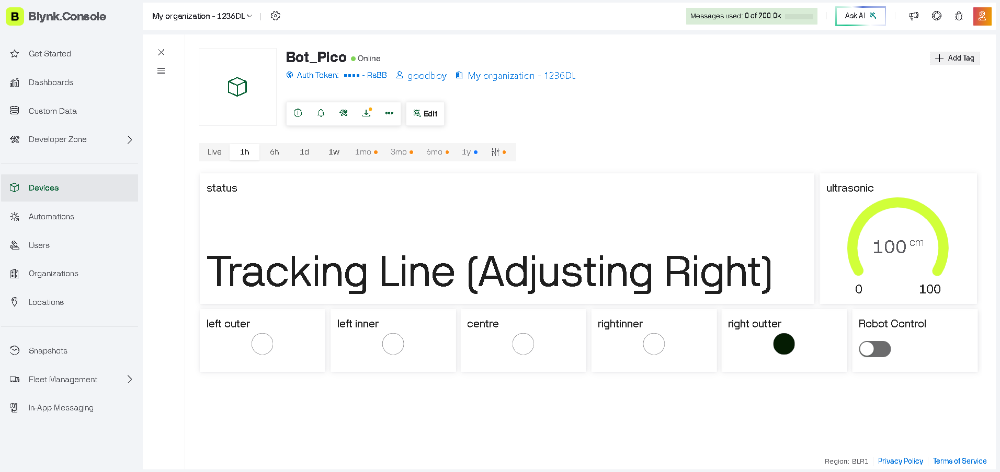

# IoT-Based Warehouse Robot (Prototype)

## Overview

This project is a prototype warehouse robot that integrates line following, obstacle avoidance, IoT telemetry, and a remote camera system. It demonstrates real-time monitoring and basic autonomous behavior using embedded systems and wireless communication.

---

## Features

- Line following using multiple IR sensors  
- Obstacle detection using ultrasonic sensor  
- IoT telemetry using Blynk  
- Remote image capture using ESP32-CAM and Telegram  

---

## System Architecture

Sensors → Raspberry Pi Pico → Motor Control  
↓  
Blynk Cloud (Telemetry)  

ESP32-CAM ← Serial Trigger ← Pico  
↓  
Telegram Image Upload  

---

## Working Principle

### Line Following
The robot uses 5 sensors (3 analog + 2 digital) to detect the line position. A PD control algorithm adjusts motor speed to follow the path.

### Obstacle Avoidance
When an obstacle is detected within 15 cm, the robot scans left and right using a servo-mounted ultrasonic sensor and selects the clearer path.

### Telemetry
Sensor values and distance data are transmitted to Blynk for real-time monitoring.

### Camera System
The ESP32-CAM captures images when triggered via serial communication and sends them to Telegram.

---

## Limitations

- No autonomous navigation (only line following)  
- Obstacle avoidance is based on fixed movement logic  
- No real-time image processing  
- Mechanical design not developed using CAD  

---

## What I Learned

- Implementation of PD control in embedded systems  
- Sensor calibration and normalization  
- IoT telemetry using Blynk  
- Memory management challenges in ESP32-CAM  
- Serial communication between microcontrollers  

---

## Images

### Telemetry Output (Blynk)

Real-time sensor data and distance monitoring displayed using Blynk.

### Camera Output (Telegram)

Image captured by ESP32-CAM and sent to Telegram upon receiving a trigger signal.

---

## Future Improvements

- Implement path planning or SLAM  
- Integrate camera-based decision making  
- Improve obstacle avoidance with dynamic algorithms  
- Redesign chassis using CAD and perform CFD/aerodynamic analysis  

---

## Author

Abin Joseph
